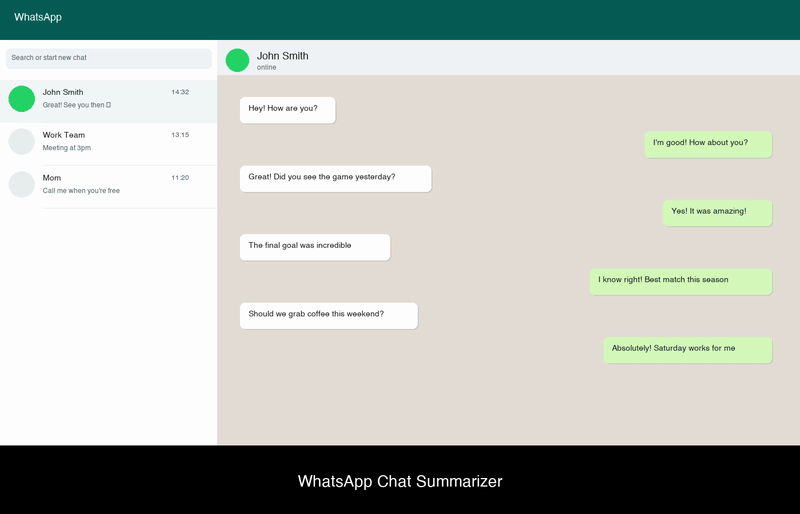

# WhatsApp Chat Summarizer

A privacy-focused Chrome extension that summarizes WhatsApp Web conversations using Chrome's built-in Gemini Nano AI.

## Demo



> **🔊 [Watch with audio narration](assets/demo.mp4)** - Download the video to hear the full explanation.

The demo shows:
- How to use the extension on WhatsApp Web
- All processing happens locally on your device using Chrome's Gemini Nano
- No data is sent to external servers
- Complete privacy and security

## Privacy First

**Your messages never leave your device.**

- All AI processing happens locally using Chrome's on-device Gemini Nano
- No data sent to external servers
- No data stored or cached
- No analytics or tracking
- No third-party dependencies
- Open source and auditable

## Features

- **Quick Summary** - Get a brief tl;dr of any conversation
- **Detailed Summary** - Get key points from longer chats
- **Ask Questions** - Ask anything about the conversation
- **Text-to-Speech** - Listen to summaries
- **Copy to Clipboard** - Easily share summaries

## Requirements

- Chrome 138 or later
- Gemini Nano Summarizer API enabled in Chrome

### Enabling Gemini Nano

1. Open Chrome and go to `chrome://flags`
2. Search for "Summarization API for Gemini Nano"
3. Set it to "Enabled"
4. Restart Chrome

## Installation

1. Clone or download this repository
2. Open Chrome and go to `chrome://extensions`
3. Enable "Developer mode" (toggle in top right)
4. Click "Load unpacked"
5. Select the `whatsapp-summarizer` folder
6. The extension icon will appear in your toolbar

## Usage

1. Open [WhatsApp Web](https://web.whatsapp.com)
2. Navigate to any chat conversation
3. Click the extension icon in your toolbar
4. Choose "tl;dr brief" or "tl;dr verbose" for summaries
5. Or switch to the "Ask" tab to ask questions about the chat

## Project Structure

```
whatsapp-summarizer/
├── manifest.json        # Extension configuration
├── content/
│   └── content.js       # Extracts messages from WhatsApp Web
├── popup/
│   ├── popup.html       # Extension popup UI
│   ├── popup.js         # Popup logic and AI integration
│   └── popup.css        # Styling
└── icons/               # Extension icons
```

## How It Works

1. **Message Extraction** - The content script reads messages from the WhatsApp Web DOM
2. **Local Processing** - Messages are passed to Chrome's Gemini Nano API
3. **On-Device AI** - Gemini Nano processes everything locally on your machine
4. **Display Results** - Summaries are shown in the popup

```
WhatsApp Web → Content Script → Popup → Gemini Nano (local) → Display
                                              ↑
                                    Never leaves your device
```

## Security

This extension follows Chrome extension security best practices:

- Manifest V3 (latest secure standard)
- Minimal permissions (activeTab, scripting)
- Explicit Content Security Policy
- Input validation and rate limiting
- No remote code execution
- Sender origin validation

## Tech Stack

- Vanilla JavaScript (no frameworks)
- Chrome Extensions API (Manifest V3)
- Chrome Gemini Nano Summarizer API
- Chrome LanguageModel API (for questions)
- Web Speech API (for text-to-speech)

## Regenerating the Demo Video

To regenerate the demo video with updated content:

```bash
cd assets
source ../.venv/bin/activate
python generate_video.py
```

This will create a new `demo.mp4` with voice narration.
